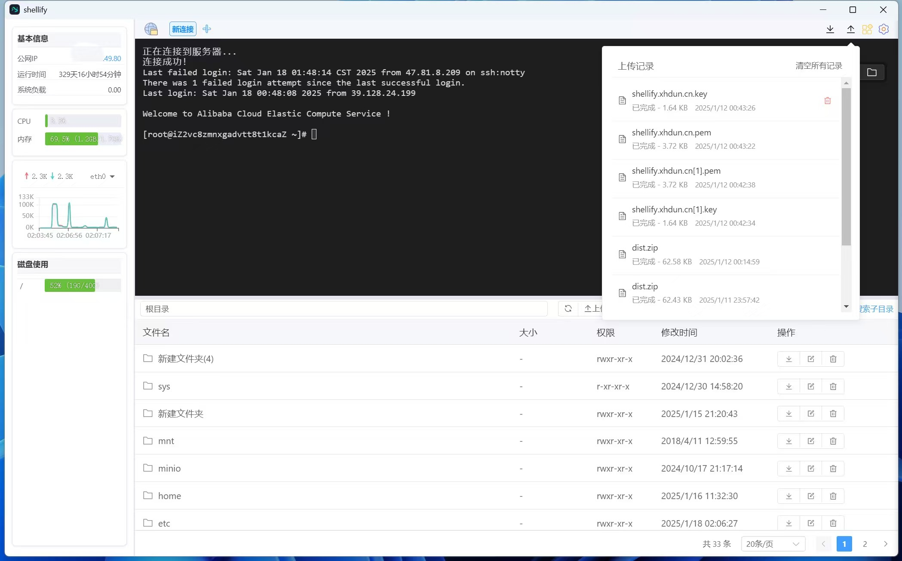
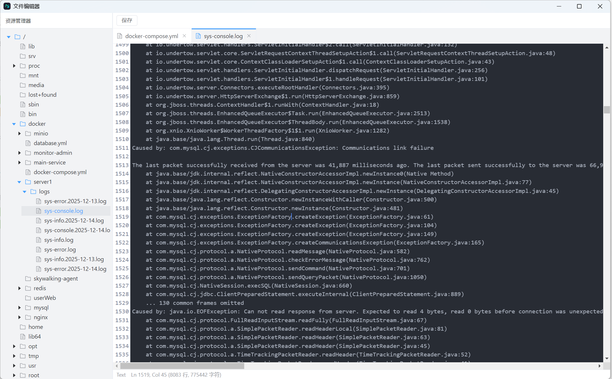

# Shellify

Shellify 是一个基于 Electron 和 Vue 3 开发的现代化 SSH 终端工具，提供了直观的图形界面和丰富的功能特性。

---

## 💬 加入微信交流群

扫描下方二维码加入 Shellify 微信交流群，获取最新版本通知、使用交流和社区支持：  

[](https://shellify.yangzhi.me/prod-api/q/wnTmYv)


## 📥 下载安装

### 方式一：官方下载页面
访问官方下载页面获取最新版本安装包：[https://shellify.yangzhi.me](https://shellify.yangzhi.me)

### 方式二：百度网盘下载

> **🔗 下载链接**：[https://pan.baidu.com/s/1tpIMI0-4mA2e7_CSC0l4cw?pwd=8888](https://pan.baidu.com/s/1tpIMI0-4mA2e7_CSC0l4cw?pwd=8888)  
> **🔑 提取码**：`8888`

---

## 效果图





## ✨ 特性

- 🖥️ **多标签终端管理**：支持多个 SSH 连接的标签式管理
- 📊 **实时系统监控**：
  - CPU、内存使用率监控
  - 网络流量实时图表
  - 磁盘使用情况
  - 系统负载监控
- 📁 **文件管理器**：
  - 可视化文件浏览
  - 文件上传/下载
  - 文件搜索
  - 基本文件操作（新建、删除等）
- 🔐 **多种认证方式**：
  - 密码认证
  - SSH 密钥认证
- 🎨 **现代化界面**：
  - 响应式设计
  - 深色/浅色主题
  - 可自定义的终端样式
- ⚡ **高性能**：
  - 异步数据处理
  - 优化的终端渲染
  - 流式文件传输

## 🚀 快速开始

### 开发安装


#### 环境要求

- Node.js >= 22
- Electron >= 31

#### 安装
1、克隆项目代码

    git clone https://github.com/xhdun/shellify.git
   
2、进入项目目录

    cd shellify

3、安装依赖

    npm install

4、启动开发环境

    windows:
     npm run dev
    mac:
     npm run macdev

## 📁 数据保存路径

Shellify 的数据文件（连接信息、设置、数据库等）在不同操作系统和环境下的保存路径如下：

### 开发环境
数据文件保存在项目根目录的 `data/` 文件夹中：
- 数据库文件：`data/shellify.db`
- 连接信息：`data/connections.json`
- 设置信息：`data/settings.json`
- 终端背景图片：`data/backgrounds/`

### 生产环境
数据文件保存在系统用户数据目录中：

#### Windows
```
%APPDATA%/shellify/
├── shellify.db          # SQLite 数据库
├── connections.json     # 连接信息
├── settings.json        # 应用设置
└── backgrounds/         # 终端背景图片目录
```
实际路径通常为：`C:\Users\<用户名>\AppData\Roaming\shellify\`

#### macOS
```
~/Library/Application Support/shellify/
├── shellify.db          # SQLite 数据库
├── connections.json     # 连接信息
├── settings.json        # 应用设置
└── backgrounds/         # 终端背景图片目录
```

#### Linux
```
~/.config/shellify/
├── shellify.db          # SQLite 数据库
├── connections.json     # 连接信息
├── settings.json        # 应用设置
└── backgrounds/         # 终端背景图片目录
```

## 🛠️ 技术栈

- Electron
- Vue 3
- Pinia
- Element Plus
- xterm.js
- SSH2
- ECharts
- better-sqlite3

## 🤝 贡献指南

欢迎提交 Issue 和 Pull Request！

## 📜 许可证

本项目采用 Apache-2.0 许可证开源。

查看 [LICENSE](LICENSE) 文件了解详情。

## 🙏 致谢

- [xterm.js](https://xtermjs.org/)
- [ssh2](https://github.com/mscdex/ssh2)
- [electron-vite](https://github.com/alex8088/electron-vite)